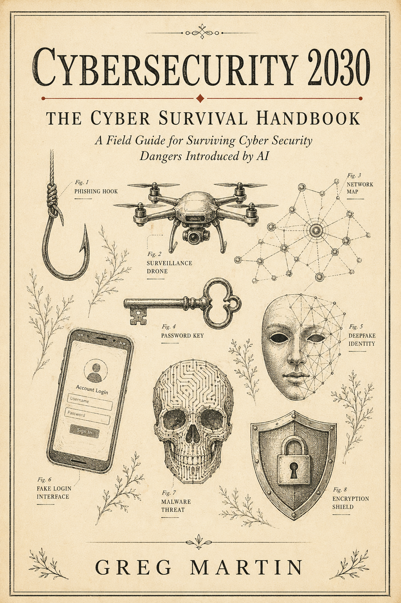

# Cybersecurity 2030

## The Cyber Survival Handbook

  

*A short, fictional survival guide from 2030 for people who want to stay human, solvent, and hard to ruin in the age of autonomous cyber attacks.*

---

## What This Is

In this near-future handbook, a survivor looks back at the 2026-2027 AI arms race between U.S. frontier labs, Chinese open model groups, private research teams, and underground operators.

The race produced miracles.

It also produced leaks.

Once powerful models escaped, people stripped their safeguards, wired them into tools, and turned them into tireless cyber operators. They could impersonate, extort, scan, phish, exploit, trade, forge, and manipulate faster than institutions could react.

This book is not about learning to attack.

It is about becoming difficult to target, impersonate, drain, or destroy.

---

## Read the Book

1. [Read This First](chapters/00-read-this-first.md)
2. [The Leak Year](chapters/01-the-leak-year.md)
3. [The New Rules](chapters/02-the-new-rules.md)
4. [Personal Survival](chapters/03-personal-survival.md)
5. [Financial and Wealth Survival](chapters/04-financial-and-wealth-survival.md)
6. [Company and Corporate Network Survival](chapters/05-company-and-corporate-survival.md)
7. [Technology Dependence and Surface Management](chapters/06-technology-dependence.md)
8. [The 30-Day Survival Sprint](chapters/07-30-day-survival-sprint.md)
9. [One-Page Checklist](chapters/08-one-page-checklist.md)

---

## Core Idea

The old internet rewarded visibility.

The new internet punishes unnecessary exposure.

The goal is not to become invisible. The goal is to become expensive to attack, hard to impersonate, slow to drain, and resilient when systems fail.

Start before the bots score you.
